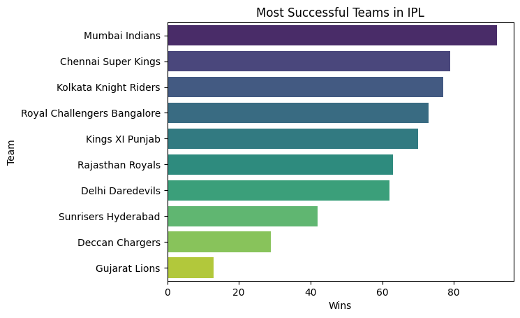
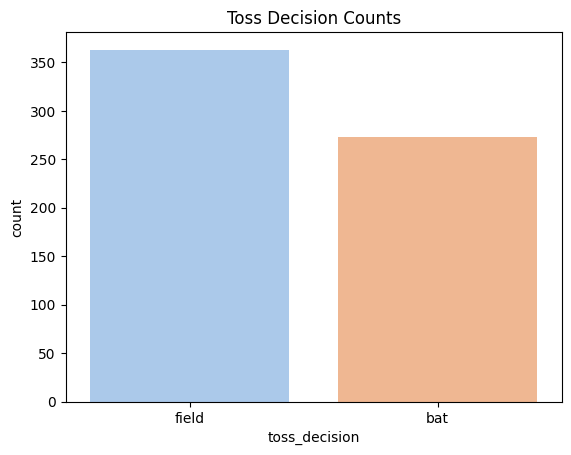
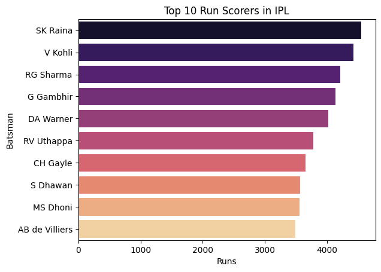
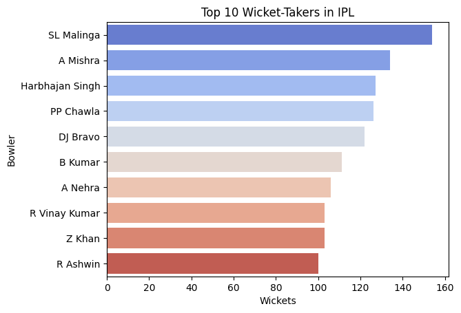

## IPL Cricket Data Analysis

A beginner-friendly project to analyze **Indian Premier League (IPL)** cricket data using Python. Demonstrates **data analysis and visualization** with Pandas, NumPy, Matplotlib, and Seaborn.

 
 
 
 

## What I Do
- Identify most successful teams and toss advantage 
- Explore top batsmen and bowlers  
- Team Performance Per Season  
- Top 10 highest scores by teams in a single match
- Most Frequent Match Venues

---

## 📊 Dataset
- Dataset from [Kaggle IPL Dataset](https://www.kaggle.com/manasgarg/ipl)  
- Includes files like:
  - `matches.csv`  
  - `deliveries.csv`  

## 🛠 Tools & Libraries
- **Python 3.x**  
- **Pandas** – data manipulation  
- **NumPy** – numerical operations  
- **Matplotlib** – plotting  
- **Seaborn** – advanced visualization  
- **VS Code** with **Jupyter Notebook**  

## 🖼 Visualizations
 
*Team wins per season*  

*Toss Decisions*

*Top 10 Run Scorers*
 
  
*Top wicket-takers*  

